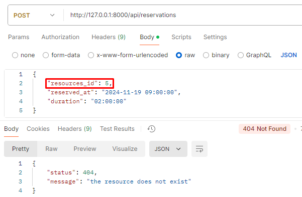
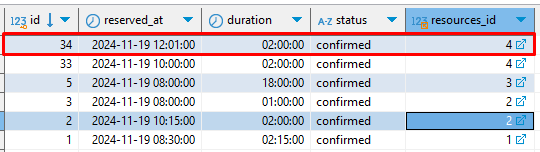

Nota: Si descarga el proyecto para ver correctamente este archivo ejecute el comando de su editor de codigo fuente para leer archivos markdown, si esta usando visual es: ctrl + shift + v

# Documentación API REST para Gestión de Reservas en un Sistema de Recursos Compartidos.

## 1. Documentación base de datos
El  modelado de la base de datos se realizó teniendo en cuenta las indicaciones de la prueba técnica, es un modelo simple en Mysql que da solución al problema es cuestión que es “gestionar reservas en un sistema de recursos compartidos”.

### 1.1. Estructura de la base de datos.

### 1.2 Diccionario de datos.

### Tabla Reservations
Definición: Guarda la información del tiempo, fecha y estado de la reserva que se realizo de un recurso.
| Nombre       | Descripción                      | Tipo de dato                        | Null | Longitud | Clave |
|--------------|----------------------------------|-------------------------------------|------|----------|-------|
| id           | Identificador de la reserva      | entero                              | no   |          | PK    |
| reserved_at  | Fecha y hora de la reserva       | fecha (timestamp)                   | no   |          |       |
| duration     | Tiempo de duración de la reserva | tiempo (time)                       | no   |          |       |
| status       | Estado de la reserva             | enum(confirmed, pending, cancelled) | no   |          |       |
| resources_id | Relación con los recursos        | entero                              | no   |          | FK    |

### Tabla Resources
Definición: Guarda la información del nombre, descripción y capacidad de los recursos.
| Nombre      | Descripción                   | Tipo de dato       | Null | Longitud | Clave |
|-------------|-------------------------------|--------------------|------|----------|-------|
| id          | Identificador del recurso     | entero             | no   |          | PK    |
| name        | Nombre del recurso            | caracter (varchar) | no   | 100      |       |
| description | Descripción del recurso       | caracter (varchar) | yes  | 200      |       |
| capacity    | Capacidad o stock del recurso | entero             | no   |          |       |

## 2. Patrones de diseño seleccionados.
Se implementan los dos patrones de diseño:

### 2.1 Patron de diseño Repository.
Se implemento para centralizar las transacciones a la base de datos, esto permite respetar el principio de resposabilidad unica ya que una clase debe ser responsable de hacer una unica tarea lo que aumenta la mantenibilidad del codigo y la reusabilidad.

### Estructura de archivos:
todas las clases repository estan alamcenadas en la siguiente ruta: App\Repositories, en esta carpeta hay tres archivos:

- ReservationRepository: Almacena todos los metodos de la capa de datos para las reservaciones esto quiere decir que contiene toda la logíca necesaria para la interacción con la base de datos y extiende o hereda los metodos de BaseRepository.

- ResourceRepository: Almacena todos los metodos de la capa de datos para los recursos esto quiere decir que contiene toda la logíca necesaria para la interacción con la base de datos y extiende o hereda los metodos de BaseRepository.

- BaseRepository: Esta clase centraliza todas las interacciones básicas de un CRUD, esto permite que ha medida que la aplicación crezca no se tenga que codificar en cada repository un metodo que sea igual y que haga lo mismo, con solo heredar sus metodos se pueden reutilizar.

### 2.2 Patron de diseño Factory.
Se implemento para centralizar la logíca de negocio que permite crear una reserva, esto permite liberar el controlador de resposabilidad y que la logíca mas compleja quede en una capa.

### Estructura de archivos:
todas las clases factory estan almacenadas en la siguiente ruta: App\Factories, en esta carpeta hay dos archivos:

-ResourceAvailabilityFactory: Esta clase se encarga de validar si la reserva puede ser creada: su funcionamiento es:

- Revisar si la reserva esta en horario laboral.

- Revisar si el recurso existe.

- Revisar si ya hay reservas existentes del recurso, en el caso que si revisa si es en el mismo día, en el caso que si revisa si es a la misma hora, en el caso que si revisa el numero de recursos disponibles y si la duración de la reserva no afecta otra, acorde a lo anterior retorna respuesta informativas.

-ReservationCreateFactory: Esta clase se encarga de crear la reserva: 

- Organizar a que horas termina la reserva.

- Envia la hora final de la reserva a la clase ResourceAvailabilityFactory si no hay ningún problema crea el registro.

## 3. Ejecución de la API.
- Configurar un ambiente de desarrollo local como XAMPP o Laragon, en este caso se uso Laragon que tiene todas las configuraciones necesarias para correr un proyecto en LARAVEL.

- Iniciar el entorno local y exportar la base de datos.

- Copiar esta API con la carpeta donde guardan los proyectos el ambiente de desarrollo.

- Con el editor de codígo fuente de preferencia ejecutar el siguiente comando en la terminal php artisan serve y esperar que Laravel inicie.

- Por ultimo desde una herramienta para consumir APIS como Postman puede comenzar hacer las pruebas.

### 3.1 Validaciones de los Endpoints
Todas los Endpoints que reciben parametros tienen una clase Request que valida que los datos se envien y que estan en el formato deseado, Ejemplo de las repuestas.

-Todos los parametros deben enviarse.

-Los parametros deben tener formato tales como enteros, date y time como se muestra en las solicitudes de los Endpoints a continuación.

### 3.2 Endpoint http://127.0.0.1:8000/api/resources
-Método: GET.

-Descripción: Retorna una lista de los recursos disponibles.

-Parametros de entrada y ejemplo de la solicitud:

-Ejemplo de la respuestas:

- 200 -> Success.

- 500 -> Internal Server Error.

### 3.3 Endpoint http://127.0.0.1:8000/api/resources/{id}/availability
-Método: GET.

-Descripción: Indica si la reserva se puede realizar y si no el porque.

-Parametros de entrada y ejemplo de la solicitud:

-Ejemplo de la respuestas:

- 200 -> Success.

- 404 -> Not Found.

- 400 -> Bad Request (Ya existe una reserva en ese horario).

- 400 -> Bad Request (Fuera de horario laboral).

- 500 -> Not Found.

### 3.4 Endpoint http://127.0.0.1:8000/api/reservations
-Método: POST.

-Descripción: Crea la reserva o indica porque no se puede crear.

-Parametros de entrada y ejemplo de la solicitud:

-Ejemplo de la respuestas:

- 200 -> Success.

- 404 -> Not Found.

- 400 -> Bad Request (Ya existe una reserva en ese horario).

- 400 -> Bad Request (Fuera de horario laboral).

- 500 -> Not Found.

### 3.5 Endpoint http://127.0.0.1:8000/api/reservations/{id}
-Método: DELETE.

-Descripción: Crea la reserva o indica porque no se puede crear.

-Parametros de entrada y ejemplo de la solicitud:

-Ejemplo de la respuestas:

- 200 -> Success.

- 404 -> Not Found.

- 500 -> Not Found.

## 4. Pruebas untiarias.
-La primera prueba es el intento de crear una reserva de un recurso que no existe.
- En el momento la base de datos solo tiene los siguientes registro:

- Si intentan crear una reserva con un recurso que no existe, entonces se obtiene el siguiente resultado:

-La segunda prueba es el intento de crear una reserva de un recurso existente pero que esta fuera del horario laboral que se de penso de 8:00 am a 6:00pm y las reservas se pueden hacer de 8:00 am a 5:00pm:

-La tercera prueba vamos a crear una reserva de un recurso que no tiene reservas creadas:

- Datos de base de datos:

- Creación del registro:

- Resultado en base de datos:

-Ya que se puede crear una reserva de un recurso que no tiene reservas, en esta cuarta prueba se va crear otra reserva en diferente hora sobre el mismo recurso y  solo tiene una unidad, luego se va intentar otro en la misma hora pero no la debe crear.

- Recurso con el cual se va hacer la prueba:

- En la imagen podemos ver que tiene una reserva de 10:00 a 12:00:

- Se crea la nueva reserva en un hora diferente pero en el mismo día:

- Se verifica en base de datos:

- Se crea una reserva en la misma hora, lo cual no funciona porque solo tiene una unidad disponible:

-Ya que se realizo en la prueba anterior con un recurso con capacidad uno ahora en esta quinta prueba se va probar con un recurso que tenga mas de 1 unidad disponible.

- Recurso con el cual se va hacer la prueba:

- El recurso ya tiene una reserva creada y se va crear otra a la misma hora pero como tiene mas de una unidad disponible debe poder crearlo pero al siguiente intento de creacion no, lo anterior se demuestra en las siguientes imagenes:

-Sexta prueba: Todo salio como se esperaba, se puede crear con normalidad, ahora se intenta crear otra nueva reserva en los horarios que no estan disponibles pasa lo siguientes:

- Forma 1, se intenta directamente crear en una hora que esta reservado el recurso:

- Forma 2, se intenta crear en una hora inicial disponible pero que su hora final se encuentra en el periodo de tiempo de otra reserva:

-Forma 3, Se intenta crear una reserva que cubre en rango de otra reserva, es decir: Si tengo una reserva creada de 8:30 a 11:30 no puedo crear una reserva nueva que empiece en 8:29 a 11:31:

- Prueba de reserva en otro día:

-Prueba septima de filtrar los recursos.

-Prueba octava de eliminar la reserva anterior.

